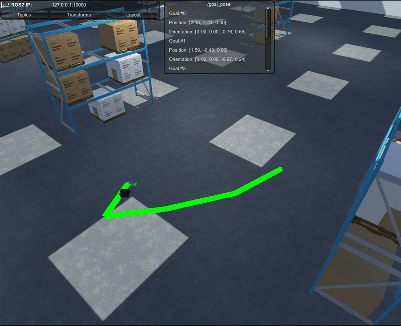

# Making a Custom Visualizer

While the Visualizations Package provides a preconfigured default visualization suite, there are many compelling cases for custom visualizations. This page steps through how to create a custom visualizer for the Nav2 project that tracks a history of `/goal_pose` messages over time, drawing a line between each point. 

**Table of Contents**
- [Creating a New Visualizer](#creating-a-new-visualizer)
    - [Drawing the UI Window](#drawing-the-ui-window)
    - [Creating Drawings](#creating-drawings)
- [Now What?](#now-what)
    - [Exercise the Example](#exercise-the-example)
    - [Automate It](#automate-it)
    - [Learn more about this Unity Scene](#learn-more-about-this-unity-scene)
    - [Import your own robot](#import-your-own-robot)
    - [Experiment with your own Scenes](#experiment-with-your-own-scenes)
    - [Learn more about Visualizations](#learn-more-about-visualizations)

> This section assumes you have already set up your environment according to the [configuration guide](dev_env_setup.md) and have run the example successfully as described [here](run_example.md).

---

## Creating a New Visualizer

- If you have the `DefaultVisualizationSuite` in your scene from the previous tutorial, the necessary components are already added for visualization.

    - If you do not have the `DefaultVisualizationSuite`, you can instead use the `EmptyVisualizationSuite`, which contains the necessary extensions for visualizations. To add the empty visualization suite, in the Project window, expand and select `Packages/Robotics Visualization`. Select the `EmptyVisualizationSuite` and drag it into your scene Hierarchy.

- To start writing a custom visualizer, start by making a new script in the `Assets/Scripts` directory named `PoseTrailVisualizer`.

    > To create a new script, right click on `Assets/Scripts` in Unity's Project window, and select `Create > C# Script`.

    > To skip to the end using the completed script, you can add the file from [unity_scripts/PoseTrailVisualizer](../unity_scripts/PoseTrailVisualizer.cs) to `Assets/Scripts`, attach it to a GameObject in your scene, configure the component in the inspector, and run the example.

- In your visualization suite, make a new GameObject named `TrailVisualizer` (e.g. `DefaultVisualizationSuite/TrailVisualizer`). 

    Add the newly created PoseTrailVisualizer component to the TrailVisualizer GameObject. 

    > Note that you will have to wait until Unity has finished compiling in order to add the component to a GameObject.

- Creating a new script will create a template that automatically inherits from [MonoBehaviour](https://docs.unity3d.com/Manual/class-MonoBehaviour.html) with the basic using directives. To turn this script into a visualizer, we'll need to reference the additional required packages. This includes the generated messages, ROS Geometry for coordinate conversions, and, of course, message visualizations.

    Open your newly created script for editing. At the top of the script, import these namespaces:

    ```csharp
    using System;
    using RosMessageTypes.Geometry;                     // Generated message classes
    using Unity.Robotics.Visualizations;                // Visualizations
    using Unity.Robotics.ROSTCPConnector.ROSGeometry;   // Coordinate space utilities
    ```

- You now have access to the necessary classes and functions for this visualization. A visualizer that manages multiple drawings over time for a specific message type should inherit from the `HistoryDrawingVisualizer<T>` class. 

    Do this now by replacing the `MonoBehaviour` class with `HistoryDrawingVisualizer<PoseStampedMsg>`.

    <!-- > Learn more about the visualizer base classes TODO link [here](). -->

- Next, delete the template `Start()` and `Update()` functions--the base `HistoryDrawingVisualizer` class will manage what needs to happen in those MonoBehaviour functions for you.

```csharp
using System;
using System.Collections.Generic;
using RosMessageTypes.Geometry;                     // Generated message classes
using Unity.Robotics.Visualizations;                // Visualizations
using Unity.Robotics.ROSTCPConnector.ROSGeometry;   // Coordinate space utilities
using UnityEngine;

public class PoseTrailVisualizer : HistoryDrawingVisualizer<PoseStampedMsg>
{
    
}
```

Your template class should now look something like the above code block. However, this script won't do anything yet! Move onto the next step to populate the UI window for the message.

### Drawing the UI Window

In the Visualizations Package, UI windows are registered based on its topic, and will update whenever a message is sent or received on it. That being said, the visualizer base class (in this case, `HistoryDrawingVisualizer`) manages all of this already. All we'll have to do is format the message contents in the window.

- Implementations of the visualizer classes override the function `CreateGUI()` in order to populate the UI window. By default, this function will simply display the raw message converted to a string. The HistoryDrawingVisualizer acts a bit differently, managing multiple messages over time.

    Begin by adding an empty override for HistoryDrawingVisualizer's `CreateGUI` function to your visualizer script.

    ```csharp
    public override Action CreateGUI(IEnumerable<Tuple<PoseStampedMsg, MessageMetadata>> messages)
    {
        return () =>
        {

        };
    }
    ```

- The Visualizations Package contains a convenient set of utility functions to format common message types to strings as well as draw common geometries. As the messages are passed in as an IEnumerable, we can simply iterate through them and call the desired functions.

    As `/goal_pose` is a PoseStampedMsg, we will use the utility function for pose GUIs, as defined [here](https://github.com/Unity-Technologies/ROS-TCP-Connector/blob/bc6c4220d39ced0e17c64553917357d6c90fb3f2/com.unity.robotics.visualizations/Runtime/Scripts/VisualizationUtils.cs#L338). The function takes an optional string parameter that serves as a label for the formatting. In this case, label the string as with a goal number, counting up from a newly initialized counter variable.

    Add this functionality between the `return` curly brackets. Your overridden function should look as follows:

    ```csharp
    public override Action CreateGUI(IEnumerable<Tuple<PoseStampedMsg, MessageMetadata>> messages)
    {
        return () =>
        {
            int count = 0;
            foreach (var (message, meta) in messages)
            {
                message.pose.GUI($"Goal #{count}");
                count++;
            }
        };
    }
    ```

- The GUI window is almost ready to be tested! Open a terminal window in your ROS workspace. Source the workspace and, once again, run the `ros2 launch` for the project if it is not already running.

    ```bash
    ros2 launch unity_slam_example unity_viz_example.py
    ```

- Return to Unity. Select the `TrailVisualizer` object, and in the Inspector, find this `PoseTrailVisualizer` component. 

    Specify the topic to be `/goal_pose`, and change the `History Length` field to however many goals you would like to track over time--for example, `5`.

- Before we test it, we'll want to set this as the new default visualizer for `/goal_pose` messages. In your `TrailVisualizer` object, add the `Priority Setter` component. 

    > This value will default to `0`, giving it a higher priority than the default visualizers.

- Enter Play mode. Click the `Topics` button in the top-left HUD to open the list of subscribed topics. Find the `/goal_pose` topic and toggle on `2D` if it's not already on.

    <!-- On the right side of the `/goal_pose` row, click to expand the hamburger menu and select your new visualizer, `PoseTrailVisualizer`. -->

    <!--  -->

    > Note that you may have to drag the `/goal_pose` UI window out of the way in order to access the menu.

    The UI window should appear, waiting for messages on the topic. Begin publishing goal poses, and you will see the UI window update appropriately!

    > If the `/goal_pose` window still says "Waiting for message..." and shows only one message, you may have to untoggle the 2D and 3D visualizations, exit Play mode, restart Play mode, and toggle the visualizations back on.

    

Move onto the next step to begin customizing and adding the 3D drawing to your visualization.

### Creating Drawings

Like the text and UI windows, 3D visualizations from this package are customizable. A set of basic customization parameters can include, for example, the color and thickness of the lines drawn, or the text label added.

- Exit Play mode and return to the `PoseTrailVisualizer` script for editing. 

    Define these customizable parameters (line color, thickness, and label) for the trail drawing as serialized private fields at the top of your PoseTrailVisualizer class.

    ```csharp
    [SerializeField]
    Color m_Color = Color.white;
    [SerializeField]
    float m_Thickness = 0.1f;
    [SerializeField]
    string m_Label = "";
    ```

    > Note: Size-related fields are in Unity coordinates, where 1 unit = 1 meter. Learn more about visualization settings [here](https://github.com/Unity-Technologies/ROS-TCP-Connector/blob/main/com.unity.robotics.visualizations/Documentation~/README.md#visualization-settings).

- Like the GUI function, implementations of the visualizer classes also override the function `Draw()` for updating a 3D drawing in the Unity scene. Once again, the HistoryDrawingVisualizer acts a bit differently, managing multiple messages over time--the updating and cleanup of message drawings is managed by the HistoryDrawingVisualizer class--all we'll have to do is feed the pose messages in.

    Start by adding an empty override for HistoryDrawingVisualizer's `Draw` function in your visualizer script.

    ```csharp
    public override void Draw(Drawing3d drawing, IEnumerable<Tuple<PoseStampedMsg, MessageMetadata>> messages)
    {

    }
    ```

- In the Draw function, we'll define a few necessary variables for setting the drawing's color and label, as well as each intermediate point, used to draw the line segments and update the position of the text label.

    ```csharp
    var firstPass = true;
    var prevPoint = Vector3.zero;
    var color = Color.white;
    var label = "";
    ```

- Similar to the GUI window, we can simply iterate through the set of saved messages in order to update the line drawing, drawing each segment along the way using the utilities provided for Drawing3d's `DrawLine` (as defined [here](https://github.com/Unity-Technologies/ROS-TCP-Connector/blob/bfbf9774d1b9979e28cdb2c2a460fe391f5ed6fe/com.unity.robotics.visualizations/Runtime/Drawing3d/Scripts/Drawing3d.cs#L128). Add the following loop to the `Draw()` function.

    ```csharp
    foreach (var (msg, meta) in messages)
    {
        var point = msg.pose.position.From<FLU>();
        if (firstPass)
        {
            color = VisualizationUtils.SelectColor(m_Color, meta);
            label = VisualizationUtils.SelectLabel(m_Label, meta);
            firstPass = false;
        }
        else
        {
            drawing.DrawLine(prevPoint, point, color, m_Thickness);
        }

        prevPoint = point;
    }
    ```

- Finally, we want to update the position of the text label to be at the most updated position, so add a call to the utility `DrawLabel()` after the `foreach` loop.
    
    ```csharp
    drawing.DrawLabel(label, prevPoint, color);
    ```

Your overridden function should look as follows:

```csharp
public override void Draw(Drawing3d drawing, IEnumerable<Tuple<PoseStampedMsg, MessageMetadata>> messages)
{
    var firstPass = true;
    var prevPoint = Vector3.zero;
    var color = Color.white;
    var label = "";

    foreach (var (msg, meta) in messages)
    {
        var point = msg.pose.position.From<FLU>();
        if (firstPass)
        {
            color = VisualizationUtils.SelectColor(m_Color, meta);
            label = VisualizationUtils.SelectLabel(m_Label, meta);
            firstPass = false;
        }
        else
        {
            drawing.DrawLine(prevPoint, point, color, m_Thickness);
        }

        prevPoint = point;
    }

    drawing.DrawLabel(label, prevPoint, color);
}
```

- Your visualizer is ready to fully test! You are free to modify the thickness, color, and label of the visual in the `PoseTrailVisualizer`'s Inspector window. We left the thickness at the default `0.1`, chose a lime green color, and set the label to say `Goal!`.

    Enter Play mode. Once again, open the `Topics` tab and turn on the `3D` toggle if it is not already on, and begin publishing goal poses. You should now see line segments connecting each of the published goal poses in order.

You have now completed the tutorial for creating a custom visualizer for your Nav2 simulation!



---
---

## Now What?

### Exercise the Example 
Feel free to try different 2D Goal Poses and watch the TurtleBot3 navigate the environment and build its map. In the Unity Scene view, you can click on different objects and, using the Transform handles, drag them to different positions in the warehouse to quickly re-configure the test environment. If doing this while RViz is active, you can observe how the Nav2 stack and slam_toolbox respond to dynamic obstacles in the scene.

You may also modify the parameters of the LaserScan sensor and observe how different ranges, fields of view, and scan density affect the quality of the SLAM map:  


Note that any changes made while in PlayMode (while the play button is lit and you are communicating with ROS) will be undone automatically when PlayMode is stopped. This is by design to allow for low-risk experimentation without accidentally breaking your Scene.  To make permanent changes, exit PlayMode first by pressing the play button, and be sure to save your Scene when you are done!

---

### Automate It

Selecting `Window->General->Test Runner` from the drop-down menu at the top will open a panel which displays any Tests defined for the Project. 


This is an example integration test which, when executed, will open a simple scene with a few waypoints defined in the hierarchy.  The test script will publish each waypoint in order, as goal poses, and evaluate "Success" based on the Turtlebot's ability to navigate to each waypoint within the time limit. To see this test execute, ensure you have freshly launched ros2 environment (`ros2 launch unity_slam_example unity_slam_example.py`) and then simply double-click the test in the Test Runner panel.  The source code for this test is located in `Assets/Scripts/Tests/PlayMode/WaypointIntegrationTest.cs`.

---

### Learn more about this Unity Scene

For more information about how the different components in this simulation function, and how the ROS2 environment is set up, we have a separate [page](explanation.md) that goes into more granular detail.

---

### Import your own robot
The Turtlebot3 prefab in this project was derived from the prefab generated by our [URDF Importer package](https://github.com/Unity-Technologies/URDF-Importer#importing-the-robot-using-urdf-file). Visit the link to find instructions on how to import your own URDF into this or any other Unity Project.

---

### Experiment with your own Scenes

The `turtlebot3_manual_config` object can be found in the `Project Browser` under the `Assets/Prefabs` folder. This prefab should contain everything necessary to enable SLAM and Navigation in any (mostly flat) Unity scene with a floor and objects for the robot's laser scan to detect. Import a Unity Scene into the project, or create a new one in the Editor, and simply drag this prefab from the `Project Browser` into the `Hierarchy`. If you'd like to learn in greater detail about how to use the Unity Editor to set up such a scene, refer back to [the repository README section entitled "Learning More About Unity"](../README.md)

### Learn more about Visualizations

To learn more about using the Visualizations Package, visit the package [documentation](https://github.com/Unity-Technologies/ROS-TCP-Connector/blob/main/com.unity.robotics.visualizations/Documentation~/README.md).