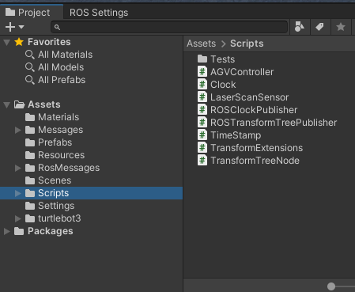

# Breaking down this example...
This page contains brief explanations and justifications for the various components in the Unity and ROS 2 workspaces that we wrote for this example.

**Table of Contents**
- [The Unity Project](#the-unity-project)
    - [Scripts](#scripts)
        - [AGVController](#agvcontroller)
        - [Clock](#clock)
        - [LaserScanSensor](#laserscansensor)
        - [ROSClockPublisher](#rosclockpublisher)
        - [ROSTransformTreePublisher](#rostransformtreepublisher)
    - [Prefabs](#prefabs)
        - [Marker](#marker)
        - [TurtleBot3ManualConfig](#turtlebot3manualconfig)
    - [Scenes](#scenes)
        - [SimpleWarehouseScene](#simplewarehousescene)
        - [BasicScene](#basicscene)
- [The ROS 2 Workspace](#the-ros-2-workspace)
    - [Launch file (unity_slam_example.py)](#launch-file-unity_slam_examplepy)
    - [RViz config (nav2_unity.rviz)](#rviz-config-nav2_unityrviz)
    - [Other project files](#other-project-files)

---
## The Unity Project

Everything we've created to enable this particular Project lives inside the Assets folder, which you can locate in the Project Browser panel.

### Scripts

We often use our example projects as a way to exercise prototype code and validate the design of functionality we may release as fully realized features in the future. Inside the scripts folder you will find a few of these prototypes. We've lightly documented them here, but feel free to browse the current state of the code for additional insight into how they work. 

#### AGVController
The Automated Guided Vehicle Controller. This Monobehaviour serves as a bridge between externally issued control signals and the `ArticulationBody` physics classes that we rely on to move our robots in physically accurate ways. 

#### Clock
In order to keep ROS 2 nodes and our time-dependent code in Unity synced, we define a `Clock` class that serves as an abstraction layer to ensure we use the same interface to access either Unity time or a ROS 2 time source. For the purposes of this example, we assume `use_sim_time` is true, and that Unity is providing the definitive clock.

#### LaserScanSensor
A simple implementation of a "perfect" 2-dimensional LIDAR sensor which provides scans instantaneously and without any signal noise. We are working hard to implement accurate, high-fidelity sensor models to replace simple examples like this in the future.

#### ROSClockPublisher
As the name implies, this publishes the output of our Clock class to the ROS `/clock` topic at fixed intervals. This allows other ROS 2 nodes to subscribe and stay in sync with the currently simulated time.

#### ROSTransformTreePublisher
This class, along with `TimeStamp`, `TransformExtensions`, and `TransformTreeNode`, allows us to construct and publish `tf2::TFMessage`s to ROS 2, representing the current state of the physical simulation in Unity. 

### Prefabs
A few objects in our scene needed to be modified manually from what is produced by default by our tools. [Prefabs](https://docs.unity3d.com/Manual/Prefabs.html) are a useful way to modify and store specially configured objects for a particular scene.

  

#### Marker

A simple sphere used to visualize LaserScan hits in the scene.

#### TurtleBot3ManualConfig

Often to support a specific use case in Unity, we need to modify an imported URDF to account for problematic mesh issues, like intersecting physics colliders, and to manually integrate components that we haven't implemented automated support for yet, like attaching a LaserScan sensor to the robot. If you double-click this prefab, Unity will display the Prefab Hierarchy in place of the usual Scene Hierarchy.

Most of what's in this Hierarchy was automatically generated by [URDF-Importer](https://github.com/Unity-Technologies/URDF-Importer), but we've made a number of changes:  
* On the `base_scan` GameObject, we've attached the LaserScanSensor in lieu of having an appropriate sensor auto-generated at import time
* Under the `base_link` GameObject, we've adjusted the size of the BoxCollider attached to `Box` to ensure the TurtleBot chassis doesn't collide with other parts, like its wheels. For some use cases, like with articulated manipulator robots, we'd want to keep these collisions as accurate as possible, but for AMR cases, self-collisions are less useful. They can also lead to the accumulation of unrealistic normal forces as components continuously collide with each other when the robot is in motion.
* Since the free-rolling caster wheels are particularly difficult to simulate accurately, we've temporarily replaced them with a single, frictionless sphere on a tightly constrained spring joint, called `caster_center_manual_config`.

---

### Scenes
#### SimpleWarehouseScene
  

This is a prefab scene generated by our [Robotics Warehouse Package](https://github.com/Unity-Technologies/Robotics-Warehouse). The package is already installed in this project, alongside the [Unity Perception](https://github.com/Unity-Technologies/com.unity.perception) package which provides the tooling that enables us to generate more randomized warehouses like this one. More instructions on how to use the Robotics Warehouse are [here](https://github.com/Unity-Technologies/Robotics-Warehouse/blob/main/Documentation/Usage.md), and a more in-depth explanation of the randomizers that it leverages are [here](https://github.com/Unity-Technologies/com.unity.perception).

#### BasicScene
  

A simple, constrained environment consisting of a few basic primitives which was useful for validating basic functional changes of the Unity and Nav2 interactions during development of this example.

--- 

## The ROS 2 Workspace

The ROS 2 workspace is relatively simple for this Project, as we are, for the most part, just calling the default Nav2 and slam_toolbox launch files with small modifications to account for Unity being used as the simulator instead of Gazebo.

### Launch file (unity_slam_example.py)
Simply includes the appropriate LaunchDescriptions from the [nav2 example](https://navigation.ros.org/tutorials/docs/navigation2_with_slam.html) but also ensure `use_sim_time` is set to `True` across all Nodes

### RViz config (nav2_unity.rviz)
Defines an RViz layout to support visualizing the topics that will be published from Unity.

### Other project files
`package.xml`, `setup.cfg`, and `setup.py` are simply bog standard ROS 2 package files. We pulled these directly from examples in the ROS 2 tutorials and stripped away anything that was not necessary to support our example.
