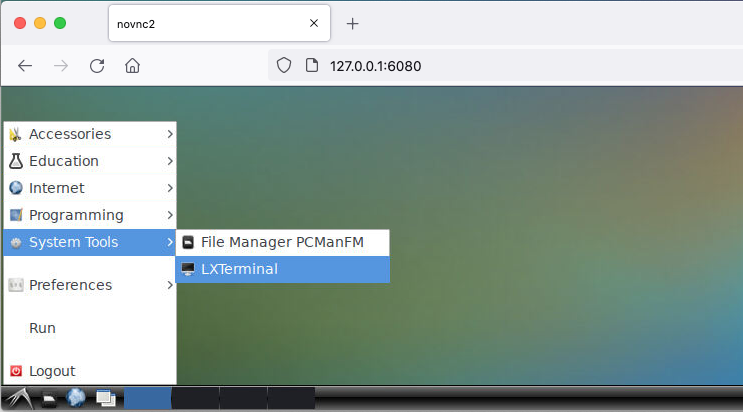
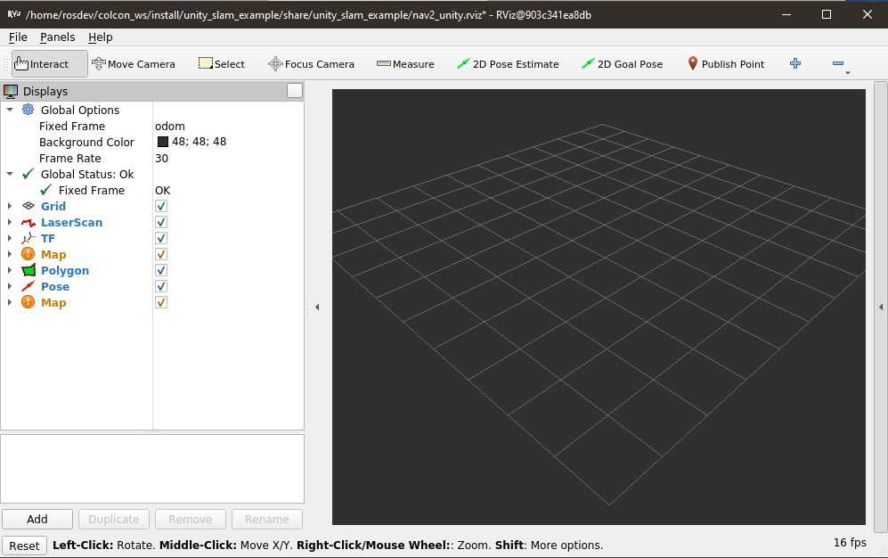

# Running the Nav2 + slam_toolbox Example
## Start RViz in the Docker container
>This section assumes you have already  set up your environment according to the guide [here](dev_env_setup.md)

- In a terminal on your host OS, run the following:

    ```
    docker run -p 6080:80 -p 10000:10000 -p 5005:5005 --shm-size=1024m unity-robotics:nav2-slam-example
    ```

- In a web browser connect to [http://127.0.0.1:6080](http://127.0.0.1:6080) and follow the steps below:

    - Click on the bottom left system menu and select `System Tools > LXTerminal`
      

    - In the Terminal run:
      ```
      ros2 launch unity_slam_example unity_slam_example.py
      ```
- If everything is configured correctly, you should see an RViz window open that looks like this:
  
  


You may also see the following message being spammed in the console:
```
[controller_server-4] [INFO] [1626978106.918019100] [local_costmap.local_costmap]: Timed out waiting for transform from base_link to odom to become available, tf error: Invalid frame ID "base_link" passed to canTransform argument source_frame - frame does not exist
```
This is normal, as the transform frames will be sent from Unity, which hasn't started yet.

### (Optional) Launching ROS2 components manually
- If you are managing your own ROS2 environment, you can launch the example manually by using:
    ```
    ros2 launch unity_slam_example unity_slam_example.py
    ```
If this doesn't work, you may need to first `colcon build` the workspace or `source install/local_setup.bash` to properly populate your ROS2 paths.


---
---

## Start the Unity simulation
>This section assumes you have already set up your Unity environment according to the guide [here](unity_project.md).  

- With the SimpleWareHouseScene open, simply press the Play button at the top of the Editor.  
  
  

If the ROS2 nodes were already launched, you should see flashing, non-red arrows in the top-left HUD to indicate Unity is communicating with ROS.

---
---

## Interacting with this Example
- Once both the ROS2 nodes and Unity simulation are started and communicating correctly, you should see the occupancy map start to fill up in RViz.


- The TurtleBot is now localizing AND mapping, simultaneously!  Now, to do navigation, click the `2D Goal Pose` button, and left-click, drag, and release a location in RViz to send a commanded pose to the navigation stack.


Congratulations! The TurtleBot is now navigating the map as it generates it from laserscan data published from Unity. 

> While the Nav2 stack is pretty robust to most goal inputs, it may occasionally crash or otherwise reach a state where it no longer responds as expected. These issues can most of the time be fixed by simply killing and restarting the nav2 nodes, and pressing `Play` twice in Unity to stop and restart the simulation.

---
---

## Now What?
### Exercise the Example 
Feel free to try different 2D Goal Poses and watch the TurtleBot3 navigate the environment and build its map. In the Unity Scene view, you can click on different objects and, using the Transform handles, drag them to different positions in the warehouse to quickly re-configure the test environment. If doing this while RViz is active, you can observe how the nav2 stack and slam_toolbox respond to dynamic obstacles in the scene.

You may also modify the parameters of the LaserScan sensor and observe how different ranges, fields of view, and scan density affect the quality of the SLAM map:  


 Note that any changes made while in PlayMode (while the play button is lit and you are communicating with ROS) will be undone automatically when PlayMode is stopped. This is by design to allow for low-risk experimentation without accidentally breaking your Scene.  To make permanent changes, exit PlayMode first by pressing the play button, and be sure to save your Scene when you are done!

 ---

### Learn more about this Unity Scene

For more information about how the different components in this simulation function, and how the ROS2 environment is set up, we have a separate [page](explanation.md) that goes into more granular detail.

---

### Import your own robot
The Turtlebot3 prefab in this project was derived from the prefab generated by our [URDF Importer package](https://github.com/Unity-Technologies/URDF-Importer#importing-the-robot-using-urdf-file). Visit the link to find instructions on how to import your own URDF into this or any other Unity Project.

---

### Experiment with your own Scenes

The `turtlebot3_manual_config` object can be found in the `Project Browser` under the `Assets/Prefabs` folder. This prefab should contain everything necessary to enable SLAM and Navigation in any (mostly flat) Unity scene with a floor and objects for the robot's laser scan to detect. Import a Unity Scene into the project, or create a new one in the Editor, and simply drag this prefab from the `Project Browser` into the `Hierarchy`. If you'd like to learn in greater detail about how to use the Unity Editor to set up such a scene, refer back to [the repository README section entitled "Learning More About Unity"](../README.md)


---
---

## Troubleshooting

**If you get the following error:**
```
launch.invalid_launch_file_error.InvalidLaunchFileError: Caught exception when trying to load file of format [py]: "package 'ros_tcp_endpoint' not found, searching: ['/home/rosdev/colcon_ws/install/unity_slam_example', '/opt/ros/foxy']"
```
You likely forgot to check out the submodules when following the [setup instructions](dev_env_setup.md). You will need to check them out with `git submodule update --init --recursive` and re-build the container as per the instructions in the linked page.
