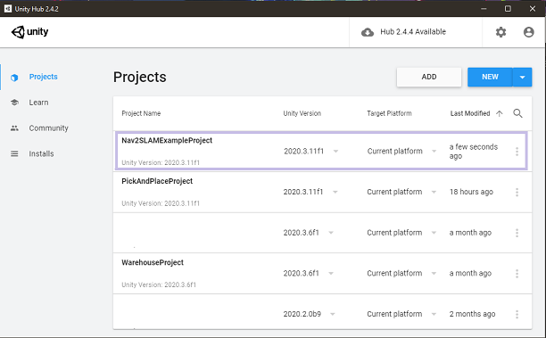
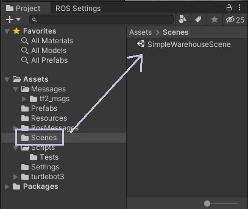
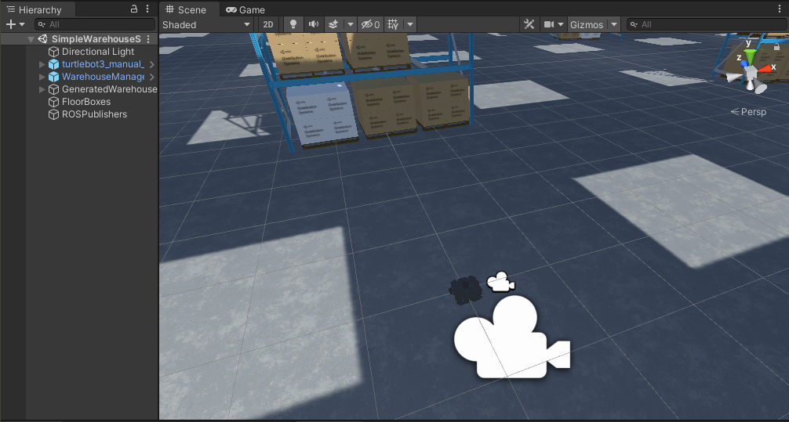
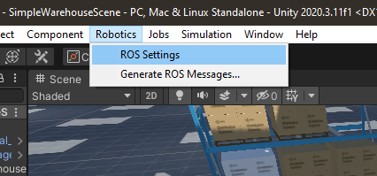
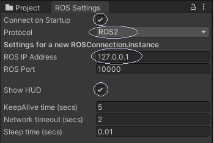

# Setting up the Unity Project

## Open the Unity Project
Assuming you have already [configured your dev environment](dev_env_setup.md), you can open the `Nav2SLAMExampleProject` either by adding the directory to your Unity Hub via the `Add` button, or opening it directly from an open Editor. 

> On Linux, you may encounter a bug in the Hub where, if you have no Projects in your list already, Add will not work properly. If you see this, create a New, empty project first, then try and Add Nav2SLAMExampleProject again.
---

## Open the SimpleWarehouseScene
Find the example scene, SimpleWarehouseScene, in the project browser, located in the bottom left of the Editor by default, and open it by double-clicking. 

   

You should see something like this open in your Editor window:  

---

## Configure your ROS Settings
Use the `Robotics` drop-down menu to open the `ROS Settings` menu.  

  
In the ROS Settings panel:
* Check the `Connect on Startup` checkbox
* Ensure `Protocol` is set to `ROS2`
* Set your `ROS IP Address` to the address of the adapter your ROS2 environment is using. For those using a Docker container on the same machine as per our guidance from the [setup instructions](dev_env_setup), this will be the default: `127.0.0.1`  
* Check the `Show HUD` checkbox to ensure you get visual feedback on the state of your ROS connection later

  

---

## Continue to running the example
Everything is now configured to [run the example](run_example.md). If you'd like to understand more about how this project is set up and what the different components are doing, you may skip to [Understanding the Project Components](explanation.md)
