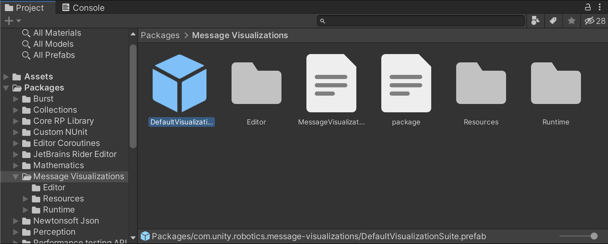
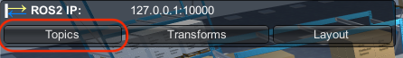
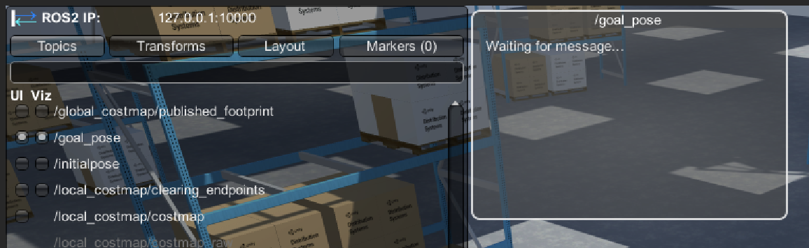
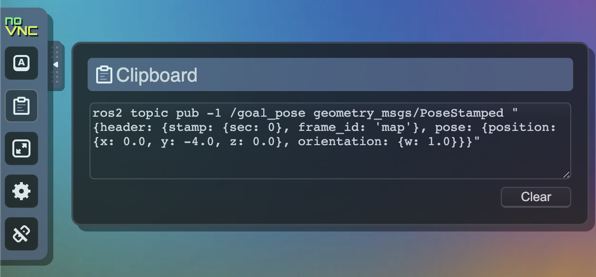
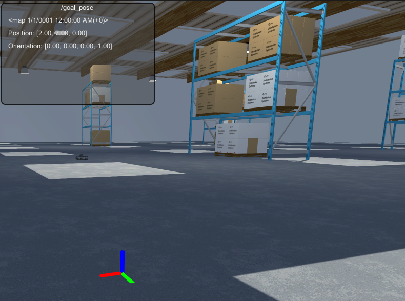
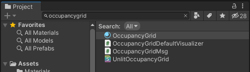
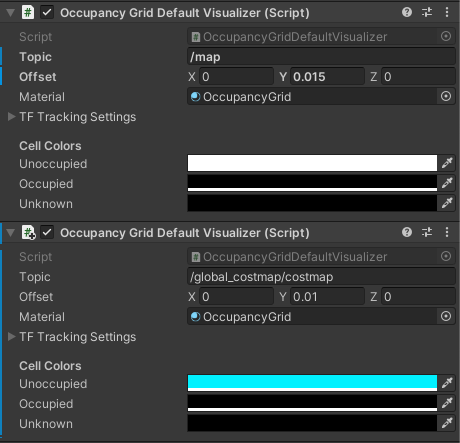
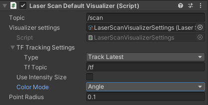

# Visualizing Nav2 in Unity

There are a variety of reasons that visualizations can be useful in a simulation, both in realtime and in playback. Seeing the data being sent and received within the context of the simulated world offers more information and a better understanding of the state of the simulation, offering insights into data like realtime sensor readings and control signals.

This page introduces the Visualizations Package to the Nav2 example running in Unity.

**Table of Contents**
- [Adding Visualizations](#adding-visualizations)
- [Goal Pose Visualization](#goal-pose-visualization)
- [Map Visualization](#map-visualization)
    - [Add Global Costmap Visualization](#add-global-costmap-visualization)
- [Laser Scan Visualization](#laser-scan-visualization)
- [More with Visualizations](#more-with-visualizations)
- [Troubleshooting](#troubleshooting)

> This section assumes you have already set up your environment according to the [configuration guide](dev_env_setup.md) and have run the example successfully as described [here](run_example.md).

---

## Adding Visualizations

> The Visualizations Package has already been added to this Unity project. You can verify this in the `Window > Package Manager`. To add Visualizations to your own project, learn more in the package [documentation](https://github.com/Unity-Technologies/ROS-TCP-Connector/blob/main/com.unity.robotics.visualizations/Documentation~/README.md#installation).

The Visualizations Package contains a `DefaultVisualizationSuite` prefab that provides visualizer components for many common ROS message types, organized in the hierarchy by package. These components control how messages are displayed in the Unity scene.

- If Unity is still in Play mode, exit Play mode.

- To add the default visualization suite, in the Project window, expand and select `Packages/Robotics Visualization`. Select the `DefaultVisualizationSuite` (indicated by the blue cube Prefab icon) and drag it into your scene Hierarchy.

    

## Goal Pose Visualization

Topics will, by default, populate in the top-left HUD's `Topics` list. Let's begin with visualizing the Nav2 `/goal_pose`, a [geometry_msgs/PoseStamped](http://docs.ros.org/en/api/geometry_msgs/html/msg/PoseStamped.html) message.

- If your previous navigation ROS nodes are still running, shut them down. Instead, run the visualization-focused launch file provided:

    ```
    ros2 launch unity_slam_example unity_viz_example.py
    ```

- In Unity, enter Play mode. Select the `Topics` tab in the HUD. 

    

    Click into the search bar, and begin typing `/goal_pose`. When it appears, select the `/goal_pose` topic name to toggle both the `2D` and `3D` options. Alternatively, you can select each individual toggle. `2D` toggles a GUI window that displays a text-formatted version of the message. `3D` toggles the 3D drawing.

    > If the HUD is not visible, ensure your connection throws no errors, your Nav2 ROS nodes are still running, and that `Show HUD` in the ROS Settings is on.

    > Topics that appear *white* are of a ROS message type that has a visualizer component in the scene. Topics that appear *grey* are of a ROS message type that does *not* currently have a visualizer component in the scene. Read more about this in the [Usage Documentation](https://github.com/Unity-Technologies/ROS-TCP-Connector/blob/main/com.unity.robotics.visualizations/Documentation~/README.md).

- You should now see a new window labeled with the `/goal_pose` topic in your Game view, saying "Waiting for message..."

    You can click and drag the edges of the UI to adjust the size and placement of the topic's window. 

    > Your UI layout and visualized topics are automatically saved to your local machine, which will be loaded next time you enter Play mode. 
    
    > You can also specifically export and load layouts from your filesystem using the HUD's `Layout` tab. Learn more about this feature in the [Usage Documentation](https://github.com/Unity-Technologies/ROS-TCP-Connector/blob/main/com.unity.robotics.visualizations/Documentation~/README.md).

    You can now click the `Topics` tab again to close the list.

    

- Open a new terminal in your ROS workspace and begin publishing goal poses, e.g.:

    ```bash
    ros2 topic pub -1 /goal_pose geometry_msgs/PoseStamped "{header: {stamp: {sec: 0}, frame_id: 'map'}, pose: {position: {x: 0.0, y: -4.0, z: 0.0}, orientation: {w: 1.0}}}"
    ```

    > If you are using the suggested Docker + noVNC environment, you can copy and paste text into the environment by expanding (`◀`) the menu on the noVNC dock and selecting the clipboard icon. You can then add text into the box to add it to the Docker container's clipboard.

    > 

    Go ahead and publish different goal poses. In Unity, you should be able to see the goal pose drawing and the window update as messages are received on the topic!

    

## Map Visualization

Next, we'll visualize the map being made. 

- In Unity, select the `Topics` tab in the HUD to open the list again. Type `/map` in the search bar, then select the `3D` toggle next to the `/map` topic name to toggle on the 3D drawing.

The map should now be appearing in the scene as the `/map` topic receives updates from ROS! 

### Add Global Costmap Visualization

You may also want to view the costmap at the same time. We know this is another occupancy grid message. Without specifying a topic, the visualizations for a ROS message type will follow the configuration for its Default Visualizer. In this scenario, that means that if you were to turn on the visualizations for `/map` and `/global_costmap/costmap`, it would be hard to distinguish between the two of them, as they'd both have the same exact customization from the `Occupancy Grid Default Visualizer`!

To solve this, you can add multiple visualizers--one for each topic. By specifying the topic for each visualizer, this allows you to customize the visualization for each topic, even for messages of the same ROS message type.
 
- Exit Play mode. 

- In the scene Hierarchy, expand the `DefaultVisualizationSuite`. Expand the `nav_msgs` child object and select the `OccupancyGrid` object to open its Inspector.

- Specify the `Topic` to be `/map`. 

- Although the default visualization suite is provided as a prefab, you are free to make changes to the suite for your own use. 

    Still on the `OccupancyGrid` object's Inspector window, click `Add Component`. Begin searching for `Occupancy Grid Default Visualizer` and add it to the object. You should now have two occupancy grid visualizers on this object!

    > The `+` icon on the newly added component indicates that it is added to a prefab, but the changes on it exist in this particular scene, and not the prefab file itself.

- On the newly added component, specify this `Topic` as `/global_costmap/costmap`.

- To set the default material to the new Occupancy Grid visualizer, assign the `Material` field to the OccupancyGrid material, found in `Packages/Robotics Visualization/Runtime/Materials/OccupancyGrid`.

    > You can find this file by searching in the Project window. Note that you will have to change the Search type from "In Assets" to "All". You can then select the `OccupancyGrid` material and drag and drop it into the `Material` field in your Occupancy Grid Default Visualizer's Inspector.

    > This material uses the provided OccupancyGrid shader, which has default behaviors for layering, transparency, color settings, and more, but you may also create and use your own material!

    

- You may now want to differentiate between the two occupancy grid visualizers--in the `Unoccupied` Cell Color field of these two visualizers, feel free to start changing colors! We kept the `/map` as white, and changed the `/global_costmap/costmap` to be a light blue.

    

- Once again, enter Play mode. 

    > You may have to restart your ROS nodes before re-entering Play mode if you encounter unexpected issues. Check the [Troubleshooting](#troubleshooting) section below.

    In the HUD's Topics window, toggle on the `3D` for `/global_costmap/costmap` now.

You should now see the two maps updating in realtime! As you send goal poses to Turtlebot, the occupancy grid drawings should now update as expected.


## Laser Scan Visualization

Finally, let's visit how the laser scan sensor is being visualized in the scene. Using the Visualizations Package, point cloud-type visualizations are highly customizable. This section will walk through customization options for a sensor_msgs/LaserScan visualization for your Nav2 project.

- If you are still in Play mode, exit it. 

- In the scene Hierarchy, once again expand the `DefaultVisualizationSuite`. This time, expand the `sensor_msgs` object and select `LaserScan` to open its Inspector.

    In the `Topic` field, enter `/scan`.

- For messages with stamped headers, we need to specify how we want the visualizations to be drawn with respect to the TF tree. This is done via the `TF Tracking Settings`; click it to expand the options. 

    In this case, we want the laser scan to be drawn with respect to the most recent transform we have for its parent: Turtlebot's `base_scan`. To do so, change the `Type` to `Track Latest`. The `TF Topic` should be left as the default `/tf`.

    > Because the TF Tracking Type is set to Track Latest, in your scene Hierarchy, you can expand the `map` frame GameObject all the way down to find the `base_scan/Drawing/PointCloud` object. Learn more about TF tracking options in the [Usage Documentation](https://github.com/Unity-Technologies/ROS-TCP-Connector/blob/main/com.unity.robotics.visualizations/Documentation~/README.md).

- Enter Play mode. Open the HUD's `Topics` tab again, and click `3D` toggle for `/scan`. The laser scan message should now be drawing and updating!

We can continue to customize this visualization during runtime. Return to `DefaultVisualizationSuite/sensor_msgs/LaserScan`.

> Note that only certain visualizer classes will save changes during runtime. 

- In the Inspector, select the dropdown for `Color Mode`. These settings select what value corresponds to the point's colors--distance from the sensor, intensity of the reading, or angle of the reading. Change the value between `Distance` and `Angle` and see how the point colors change.

    You can also modify the `Point Radius` to change the size of each drawn point.

    

- You now have a fully configured LaserScan visualization! You can learn more about other point cloud-type visualizations (such as PointCloud2) in the [Usage Documentation](https://github.com/Unity-Technologies/ROS-TCP-Connector/blob/main/com.unity.robotics.visualizations/Documentation~/README.md).

    

## More with Visualizations

You can proceed to the next tutorial, [Making a Custom Visualizer](custom_viz.md).

To learn more about using the Visualizations Package, visit the package [documentation](https://github.com/Unity-Technologies/ROS-TCP-Connector/blob/main/com.unity.robotics.visualizations/Documentation~/README.md).

---

## Troubleshooting

```
rclpy._rclpy_pybind11.InvalidHandle: cannot use Destroyable because destruction was requested
```
If you encounter the above error, you will need to shut down your ROS nodes between each disconnect. For example, after running the ROS nodes connected to Unity, if you exit Play mode in Unity, you will also need to shut down the ROS nodes and restart them before entering Play mode in Unity again.
