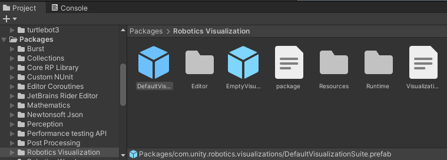
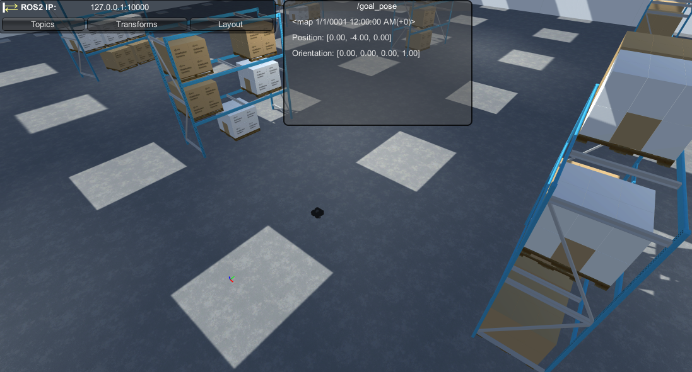
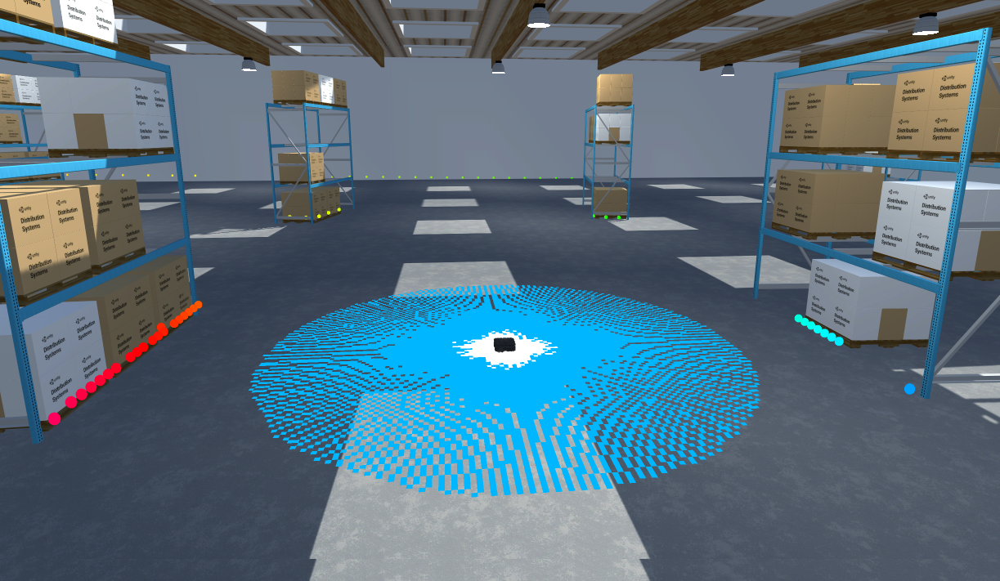

# Visualizing Nav2 in Unity

There are a variety of reasons that visualizations can be useful in a simulation, both in realtime and in playback. Seeing the data being sent and received within the context of the simulated world offers more information and a better understanding of the state of the simulation, offering insights into data like realtime sensor readings and control signals.

This page introduces message visualizations to the nav2 example running in Unity.

**Table of Contents**
- [Adding Visualizations](#adding-visualizations)
- [Goal Pose Visualization](#goal-pose-visualization)
- [Map Visualization](#map-visualization)
- [Laser Scan Visualization](#laser-scan-visualization)
- [Point Clouds](#point-clouds)

> This section assumes you have already set up your environment according to the [configuration guide](dev_env_setup.md) and have run the example successfully as described [here](run_example.md).

---

## Adding Visualizations

> The Message Visualizations package has already been added to this Unity project. You can verify this in the `Window > Package Manager`. To add Message Visualizations to your own project, learn more in the package TEMP LINK [documentation]().

The Message Visualizations package contains a `DefaultVisualizationSuite` prefab that provides visualizer components for many common ROS message types, organized in the hierarchy by package. These components control how messages are displayed in the Unity scene.

- To add the default visualization suite, in the Project window, expand and select `Packages/Message Visualizations`. Select the `DefaultVisualizationSuite` (indicated by the blue cube Prefab icon) and drag it into your scene Hierarchy.

    

## Goal Pose Visualization

Topics will, by default, populate in the top-left HUD's `Topics` list. Let's begin with visualizing the nav2 `/goal_pose`, a [geometry_msgs/PoseStamped](http://docs.ros.org/en/api/geometry_msgs/html/msg/PoseStamped.html) message.

- If your previous navigation ROS nodes are still running, shut them down. Instead, run the visualization-focused launch file provided:

    ```
    ros2 launch unity_slam_example unity_viz_example.py
    ```

- In Unity, enter Play mode. Select the `Topics` tab in the HUD. 

    

    Click into the search bar, and begin typing `/goal_pose`. When it appears, select the `/goal_pose` topic name to toggle both the `UI` and `Viz` options. Alternatively, you can select each individual toggle. `UI` toggles a GUI window that displays a text-formatted version of the message. `Viz` toggles the 3D drawing.

    > If the HUD is not visible, ensure your connection throws no errors, your nav2 ROS nodes are still running, and that `Show HUD` in the ROS Settings is on.

- You should now see a new `UI` window labeled with the `/goal_pose` topic in your Game view, saying "Waiting for message..."

    

- Open a new terminal in your ROS workspace and begin publishing goal poses, e.g.:

    ```bash
    ros2 topic pub -1 /goal_pose geometry_msgs/PoseStamped "{header: {stamp: {sec: 0}, frame_id: 'map'}, pose: {position: {x: 2.0, y: 7.0, z: 0.0}, orientation: {w: 1.0}}}"
    ```

    Go ahead and publish different goal poses. In Unity, you should be able to see the goal pose drawing and the UI window update as messages are received on the topic! You can also click and drag the edges of the UI to adjust the size and placement of the topic's window. 

    > Your UI layout and visualized topics are automatically saved to your local machine, which will be loaded next time you enter Play mode. You can also specifically export and load layouts from your filesystem using the HUD's `Layout` tab. Learn more about this feature in the [TEMP link] [Usage Documentation](https://github.com/Unity-Technologies/ROS-TCP-Connector/blob/amanda/default-tutorial/com.unity.robotics.message-visualizations/Documentation~/README.md).

    

## Map Visualization

Next, we'll visualize the map being made. 

- In Unity, select the `Topics` tab in the HUD. Select the `Viz` toggle next to the `/map` topic name to toggle on the 3D drawing.

The map should now be appearing in the scene as the `/map` topic receives updates from ROS! However, you'll notice the map seems to collide with the floor rendering. 


Let's customize this nav_msgs/OccupancyGrid visualization.

- Exit Play mode. In the scene Hierarchy, expand the `DefaultVisualizationSuite`. Select the `Nav` child object (for nav_msgs). In its Inspector window, scroll down until you find the `Occupancy Grid Default Visualizer`.

- The `Offset` will modify where the occupancy grid is drawn in the scene, which can be useful in situations where it may be obscured by the simulated world. Change the `Y` offset minimally, e.g. from 0 to `0.015`.

You may also want to view the costmap at the same time. We know this is another occupancy grid message. Without specifying a topic, the visualizations are created based on their ROS message type. You can also explicitly set the topic of each visualization to apply customizations to messages on that specific topic, allowing you to customize the visualization for each topic of the same type.

- In the `Occupancy Grid Default Visualizer` component, specify the `Occupancy Grid Topic` to be `/map`. 

- Although the default visualization suite is provided as a prefab, you are free to make changes to the suite for your own use. Still on the Nav object's Inspector window, click `Add Component`. Begin searching for `Occupancy Grid Default Visualizer` and add it to the object. You should now have two occupancy grid visualizers on this object!

    > The `+` icon on the newly added component indicates that it is added to a prefab, but the changes on it exist in this particular scene, and not the prefab file itself.

- On the newly added component, specify this `Occupancy Grid Topic` as `/global_costmap/costmap`, and similarly, update the `Offset` to something that will be below the `/map` offset, e.g. `0.01`.

- You may now want to differentiate between the two occupancy grid visualizers--in the `Color` field of these two visualizers, feel free to start changing colors! We kept the `/map` as white, and changed the `/global_costmap/costmap` to be a light blue.

    

- Once again, enter Play mode. In the HUD's Topics window, toggle on the `Viz` for `/global_costmap/costmap` now.

You should now see the two maps updating in realtime! As you send goal poses to Turtlebot, the occupancy grid drawings should now update as expected.


## Laser Scan Visualization

Finally, let's revisit how the laser scan sensor is being visualized in the scene. Using the Message Visualizations package, point cloud-type visualizations are highly customizable. This section will walk through customization options for a sensor_msgs/LaserScan visualization for your nav2 project.

- If you are still in Play mode, exit it. Start by removing the debug visuals on the current Laser Scan Sensor. 

    Do this by navigating to and selecting `turtlebot3_manual_config/base_footprint/base_link/base_scan` in your scene Hierarchy (you can also just search for `base_scan`). 

    In its Inspector window, scroll down to the `Laser Scan Sensor (Script)` and *uncheck* `Render Debug Visuals`.

    

- In the scene Hierarchy, once again expand the `DefaultVisualizationSuite`. This time, select the `Sensor` child object (for sensor_msgs). In its Inspector window, scroll down until you find the `Laser Scan Default Visualizer`.

    In the `Topic` field, enter `/scan`.

- For messages with stamped headers, there is an option to customize the coordinate frame tracking per visualization. This is set via the `TF Tracking Settings`; click it to expand the options. To create each drawing as children of respective *frame_id* GameObjects, change the `Type` to `Track Latest`. The `TF Topic` should be left as the default `/tf`.

    > Learn more about TF tracking options in the [TEMP link] [Usage Documentation](https://github.com/Unity-Technologies/ROS-TCP-Connector/blob/amanda/default-tutorial/com.unity.robotics.message-visualizations/Documentation~/README.md).

- Enter Play mode. Open the HUD's `Topics` tab again, and click `Viz` toggle for `/scan`. The laser scan message should now be drawing and updating!

    > Because the TF Tracking Type is set to Track Latest, in your scene Hierarchy, you can expand the `odom` frame GameObject all the way down to find the `base_scan/Drawing/PointCloud` object.

We can continue to customize this visualization during runtime. Return to `DefaultVisualizationSuite/Sensor` and scroll back down to the `Laser Scan Default Visualizer`.

> Note that only certain visualizer classes will save changes during runtime. Read more about the visualizer base classes TEMP LINK [here]().

<!-- - TODO: In the Inspector, turn on `Use Intensity Size`. This will swap out the `Point Radius` field for the `Max Intensity` field. You should see the point sizes change. -->
  
- In the Inspector, select the dropdown for `Color Mode.` These settings select what value corresponds to the point's colors--distance from the sensor, intensity of the reading, or angle of the reading. Change the value between `Distance` and `Angle` and see how the point colors change.

    

- You now have a fully configured LaserScan visualization! You can learn more about other point cloud-type visualizations (such as PointCloud2) in the [TEMP link] [Usage Documentation](https://github.com/Unity-Technologies/ROS-TCP-Connector/blob/amanda/default-tutorial/com.unity.robotics.message-visualizations/Documentation~/README.md).

    

## More with Message Visualizations

You can proceed to the next tutorial, [Making a Custom Visualizer](custom_viz.md).

To learn more about using the Message Visualizations package, visit the package [TEMP link] [documentation](https://github.com/Unity-Technologies/ROS-TCP-Connector/blob/amanda/default-tutorial/com.unity.robotics.message-visualizations/Documentation~/README.md).