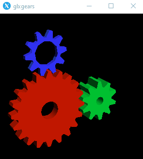
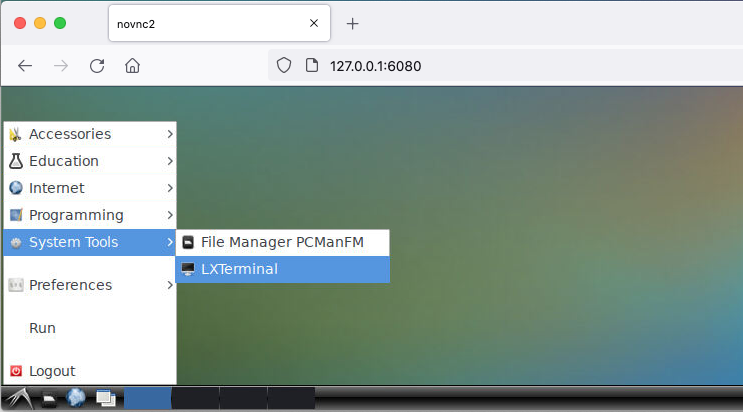

# Configure your Development Environment
---  
## Install the Unity Editor  
You will need to download the version of Unity which matches the [ProjectVersion.txt file](https://github.com/Unity-Technologies/Robotics-Nav2-SLAM-Example/blob/dev/Nav2SLAMExampleProject/ProjectSettings/ProjectVersion.txt#L1), which should be `2020.3.11f1`. You may download the editor either through the Unity Hub or directly from Unity's download site, both of which are located [here](https://unity3d.com/get-unity/download).

---

## Clone the Project
Check out the project using your method of choice, or simply copy the following line into a terminal with the `git` CLI installed:  
```
git clone --recurse-submodule git@github.com:Unity-Technologies/Robotics-Nav2-SLAM-Example.git
```  
>Observe our usage of `--recurse-submodules` to ensure any dependencies are checked out. If you miss this part, you will need to use `git submodule update --init --recursive` later to download and update the submodules.

---

## Set Up the ROS2 Environment
This project should work with any appropriately configured ROS 2 environment, but we strongly encourage building the environment from the [Dockerfile provided with the project](../ros2_docker/Dockerfile), as we may be unable to provide adequate troubleshooting support for other environments. This section will assume you are setting up your environment using our Dockerfile.

### Alternative 1: X11 Host
#### Build the Docker container
```
# From the repository root...
cd ros2_docker && \
docker build -t unity-robotics:slam-example ./
```
>This build process will take a while, but you are free to proceed to next steps in the tutorial while it is building.

#### Install an X11 host
How exactly you set up your X11 host will depend on your operating system and is to some extent a matter of personal preference.  In order to render the RViz display from inside the Docker container, you will need an X11 host appropriately configured to receive networked connection requests from the loopback interface (`127.0.0.1`) at a minimum.  There are several guides available online for setting up X11 hosts with Docker for different environments. You may also need to **configure firewall settings or other network security software to allow communication between Docker and your host machine**. We've installed mesa-utils in the image for convenience. To confirm your x11 forwarding is working, try the following command once your docker build completes:

```
docker run -it --rm -p 10000:10000 -p 5005:5005 -e DISPLAY=host.docker.internal:0.0 -e LIBGL_ALWAYS_INDIRECT=0 --entrypoint=/usr/bin/timeout unity-robotics:nav2-slam-example 10 glxgears
```

If configured correctly, you should see a window with three moving gears for 10 seconds, or however long you specify at the end of the previous `docker run` command.



There are many potential pitfalls when doing this step; most will have solutions available via StackOverflow or other troubleshooting forums. However, if you can't find an adequate solution to a problem you encounter, feel free to file an Issue ticket here and we may be able to help you troubleshoot further.

### Alternative 2: VNC
#### Build the Docker container
```
# From the repository root...
cd ros2_docker && \
docker build -f ./Dockerfile-vnc -t unity-robotics:nav2-slam-example-vnc .
```
#### Start the Docker container

- In a terminal run the following.

```
docker run -p 6080:80 -p 10000:10000 -p 5005:5005 --shm-size=1024m unity-robotics:nav2-slam-example-vnc
```

- In a web browser connect to [http://127.0.0.1:6080](http://127.0.0.1:6080) and follow the steps below:

  - Click on the bottom left system menu and select `System Tools > LXTerminal`.
  
  - In the Terminal run 
  
  ```
  launch_example
  ```
  
  


### (Optional) Using an alternative ROS2 environment
If you prefer to use your own VM, or have ROS2 installed natively and would like to use that instead, the colcon workspace for the ROS2 side is located in the `ros2_docker/colcon_ws` directory.  You can relocate this folder to your VM, or `colcon build` it directly from the workspace root. Note that you may need to use `rosdep` to ensure you have the appropriate dependencies in place before your build and execution will both succeed.

---


## Continue on to Setting up the Unity Project
Once you're done configuring your environment to support this example, you can proceed to [Setting up the Unity Project](unity_project.md).
