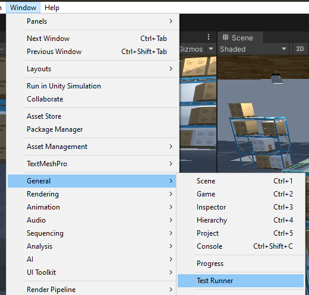

# Running the Nav2 + slam_toolbox Example
## Start the Docker container
>This section assumes you have already  set up your environment according to the guide [here](dev_env_setup.md)

Start the docker container using
```bash
docker run -it --rm -p 10000:10000 -p 5005:5005 -e DISPLAY=host.docker.internal:0.0 -e LIBGL_ALWAYS_INDIRECT=0 unity-robotics:nav2-slam-example
```
If everything is configured correctly, you should see an RViz window pop up that looks like this:


You may also see the following message being spammed in the console:
```
[controller_server-4] [INFO] [1626978106.918019100] [local_costmap.local_costmap]: Timed out waiting for transform from base_link to odom to become available, tf error: Invalid frame ID "base_link" passed to canTransform argument source_frame - frame does not exist
```
This is normal, as the transform frames will be sent from Unity, which hasn't started yet.

>If you want more control over the ROS2 components in the projects, simply add `--entrypoint=/bin/bash` to the above `docker run` command to start a bash shell rather than immediately launching everything.

### (Optional) Launching ROS2 components manually
If you are managing your own ROS2 environment, or used a bash entrypoint to stop everything from launching automatically, you can launch the example manually by using
```
ros2 launch unity_slam_example unity_slam_example.py
```
If this doesn't work, you may need to first `colcon build` the workspace or `source install/local_setup.bash` to properly populate your ROS2 paths.


---
---

## Start the Unity simulation
>This section assumes you have already set up your Unity environment according to the guide [here](unity_project.md).  

With the SimpleWareHouseScene open, simply press the Play button at the top of the Editor.  
  

If the ROS2 nodes were already launched, you should see flashing, non-red arrows in the top-left HUD to indicate Unity is communicating with ROS.

---
---

## Interacting with this Example
Once both the ROS2 nodes and Unity simulation are started and communicating correctly, you should see the occupancy map start to fill up in RViz.


The TurtleBot is now localizing AND mapping, simultaneously!  Now, to do navigation, click the `2D Goal Pose` button, and left-click, drag, and release a location in RViz to send a commanded pose to the navigation stack.


Congratulations! The TurtleBot is now navigating the map as it generates it from laserscan data published from Unity. 

> While the Nav2 stack is pretty robust to most goal inputs, it may occasionally crash or otherwise reach a state where it no longer responds as expected. These issues can most of the time be fixed by simply killing and restarting the nav2 nodes, and pressing `Play` twice in Unity to stop and restart the simulation.

---
---

## Now What?
Feel free to try different 2D Goal Poses and watch the TurtleBot3 navigate the environment and build its map. In the Unity Scene view, you can click on different objects and, using the Transform handles, drag them to different positions in the warehouse to quickly re-configure the test environment. If doing this while RViz is active, you can observe how the nav2 stack and slam_toolbox respond to dynamic obstacles in the scene.

If you'd like to see how the interaction between Unity and the ROS2 nodes could be used in an automated integration test, stop PlayMode in Unity, restart the ROS2 environment, and open the Test Runner panel under the Window -> General dropdown. 
  

From there, run the integration tests and watch the TurtleBot3 go through a series of navigation tasks, automated by the Unity Test Runner.
### >>> TODO <<<

For more information about how the different components in this simulation function, and how the ROS2 environment is set up, we have a separate [Explanation page](explanation.md) that goes into more granular detail.

---
---

## Troubleshooting

**If you get the following error:**
```
launch.invalid_launch_file_error.InvalidLaunchFileError: Caught exception when trying to load file of format [py]: "package 'ros_tcp_endpoint' not found, searching: ['/home/rosdev/colcon_ws/install/unity_slam_example', '/opt/ros/foxy']"
```
You likely forgot to check out the submodules when following the [setup instructions](dev_env_setup.md). You will need to check them out with `git submodule update --init --recursive` and re-build the container as per the instructions in the linked page.

---

**If the RViz window does not appear**, there is likely a critical error somewhere in your ROS log that needs to be identified and fixed. These are often related to X11 forwarding and will usually mention missing displays or failed OpenGL initialization.

---